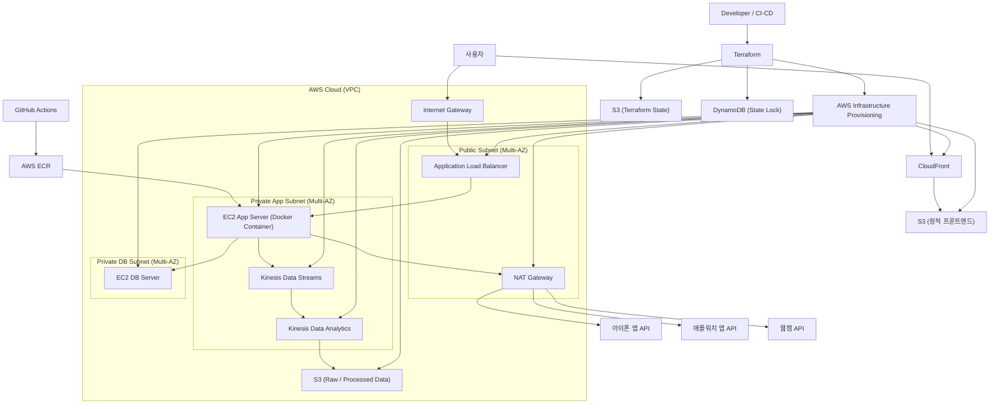

# focus-tracking-platform
하드웨어 장치와 웹캠 트래킹을 활용한 집중도 분석 플랫폼


## Architecture Diagram



## FacePhys rPPG backend integration

이 버전은 기존 브라우저 `heartbeat.js`/OpenCV rPPG 대신 FacePhys ONNX 추론을 Next.js 백엔드 API에 통합합니다.

### 변경 구조

```text
backend/
  facephys/weights/
    model.onnx        # FacePhys ONNX 모델
    state.gz          # recurrent state 초기값
  src/lib/facephys/   # FacePhys core/state/io/rPPG/BPM 서버 유틸
  src/app/api/rppg/
    session/route.ts  # FacePhys 세션 생성/삭제
    frame/route.ts    # 36x36 RGB frame 추론 및 BPM 계산
  src/hooks/useRPPG.ts # 웹캠 frame capture -> backend API 전송
```

### 실행

```bash
cd backend
npm install
npm run dev
```

`onnxruntime-node`가 추가되었기 때문에 Node.js 20 이상을 권장합니다. Dockerfile도 `node:20-bookworm-slim`으로 변경했습니다. 처음 실행할 때는 `npm ci`보다 `npm install`을 사용해 새 native dependency를 설치하고 lockfile을 갱신하세요.

### API 요약

`POST /api/rppg/session`

```json
{ "fps": 15 }
```

응답:

```json
{ "sessionId": "..." }
```

`POST /api/rppg/frame`

```json
{
  "sessionId": "...",
  "frame": [0.0, 0.1, 0.2],
  "dims": [36, 36, 3],
  "timestampMs": 1710000000000,
  "fps": 15
}
```

응답은 FacePhys waveform sample과 rolling BPM 추정값을 반환합니다. BPM은 최소 약 6초 분량의 샘플이 쌓인 뒤 `ready: true`와 함께 표시됩니다.
