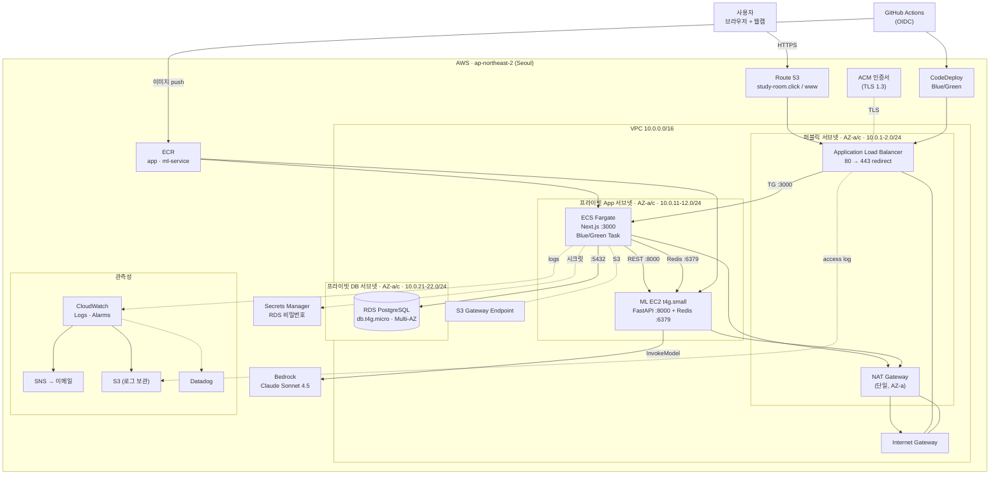
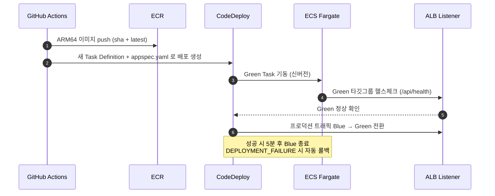

# Infrastructure — Focus Tracking Platform

이 문서는 [Focus Tracking Platform](../README.md)의 **AWS 인프라(Terraform IaC)** 를 다룹니다.
모든 리소스는 서울 리전(`ap-northeast-2`) 2-AZ 위에 코드로 정의되어 있으며, 상태는 S3 + DynamoDB에 원격 저장됩니다.

- **컴퓨팅**: ECS Fargate(앱) · EC2(ML 서비스 + Redis)
- **데이터**: RDS for PostgreSQL (Multi-AZ)
- **배포**: CodeDeploy Blue/Green · GitHub Actions(OIDC)
- **관측성**: CloudWatch · SNS · Datadog

> 환경 스택: [`terraform/environments/dev/`](environments/dev/) · 재사용 모듈: [`terraform/modules/`](modules/) · 원격 상태 부트스트랩: [`terraform/bootstrap/`](bootstrap/)

---

## 전체 아키텍처



---

## 요청 흐름

1. 사용자가 `https://study-room.click` 접속 → **Route 53** 가 **ALB** 로 alias.
2. **ALB**(HTTPS 443, ACM 인증서)가 80→443 리다이렉트 후 **ECS Fargate**(Next.js :3000)로 포워딩.
3. Fargate 앱은 **RDS PostgreSQL**(영속 데이터), **Redis**(실시간 추적 스트림), **ML EC2 FastAPI**(분석)와 통신.
4. **ML 서비스**는 Redis 세션 데이터를 읽고 **Bedrock(Claude)** 로 피드백을 생성.
5. 프라이빗 서브넷의 아웃바운드(ECR pull, Bedrock, SSM 등)는 **단일 NAT Gateway** 경유, S3는 **Gateway Endpoint** 로 직접.

---

## 배포 — CodeDeploy Blue/Green

`launch_type = FARGATE` + `deployment_controller = CODE_DEPLOY` 조합으로, 배포 시 신버전(Green) Task를 띄워 헬스체크를 통과하면 ALB 리스너 트래픽을 전환합니다. 실패 시 자동 롤백됩니다.



| 항목 | 값 |
| --- | --- |
| 배포 구성 | `CodeDeployDefault.ECSAllAtOnce` |
| 트래픽 제어 | `WITH_TRAFFIC_CONTROL` / `BLUE_GREEN` |
| 자동 롤백 | `DEPLOYMENT_FAILURE` 시 |
| Blue 종료 | 성공 후 5분 대기 후 `TERMINATE` |
| 타깃그룹 | `*-tg-blue` / `*-tg-green` (target_type=`ip`, 헬스체크 `/api/health`) |

> ML 서비스는 ECS가 아닌 **EC2** 에 배포됩니다 — GitHub Actions가 인스턴스를 태그(`Name=ml-ec2`)로 찾아 **SSM Run Command** 로 `docker compose up` 합니다.

---

## 네트워크

VPC·서브넷·라우팅·NACL·NAT·S3 엔드포인트는 재사용 가능한 **[`modules/network`](modules/network/)** 모듈로 분리되어 있고, [`environments/dev/network.tf`](environments/dev/network.tf)가 환경별 CIDR·AZ·포트 값을 넘겨 호출합니다.

### 서브넷 (VPC `10.0.0.0/16`, AZ `ap-northeast-2a` / `2c`)

| 계층 | AZ-a | AZ-c | 용도 |
| --- | --- | --- | --- |
| 퍼블릭 | `10.0.1.0/24` | `10.0.2.0/24` | ALB, NAT Gateway |
| 프라이빗 App | `10.0.11.0/24` | `10.0.12.0/24` | ECS Fargate Task, ML EC2 |
| 프라이빗 DB | `10.0.21.0/24` | `10.0.22.0/24` | RDS PostgreSQL |

### 라우팅

| 라우팅 테이블 | 대상 | 연결 서브넷 |
| --- | --- | --- |
| `public_rt` | `0.0.0.0/0` → **IGW** | 퍼블릭 a/c |
| `private_rt` | `0.0.0.0/0` → **NAT(AZ-a)** + **S3 Gateway Endpoint** | 프라이빗 App a/c, DB a/c |

> NAT은 비용 절감을 위해 **단일** 게이트웨이(AZ-a)만 운용합니다(이상적으로는 AZ별 2개).

### 보안 그룹 (최소 권한)

| SG | Ingress | Egress |
| --- | --- | --- |
| `alb_sg` | `80`, `443` ← `0.0.0.0/0` | `3000` → `web_sg` |
| `web_sg` (Fargate Task) | `3000` ← `alb_sg` | all (NAT 경유) |
| `db_sg` (RDS) | `5432` ← `web_sg` | — |
| `ml_sg` (ML EC2) | `8000`, `6379` ← `web_sg` | all (Bedrock/ECR/SSM) |

추가로 **VPC Flow Logs**(REJECT 트래픽만 → CloudWatch)와 NACL이 적용됩니다.

---

## 컴퓨팅

### ECS Fargate (애플리케이션)

- **리소스**: 1 vCPU / 2 GB, **ARM64**(Graviton), `awsvpc` 네트워크 모드
- **오토스케일링**: Application Auto Scaling — ECS 평균 CPU **75%** 타깃 트래킹으로 Task **1→2개** 자동 조정(scale-out 쿨다운 60s / scale-in 300s). Fargate는 EC2 CPU 크레딧/baseline 개념이 없어 타깃을 보수적으로 낮출 필요가 없습니다 ([`autoscaling.tf`](environments/dev/autoscaling.tf))
- **헬스체크**: ALB → `/api/health`
- 앱(FE+BE)이 **단일 컨테이너**로 묶여 있어 배포·운영이 단순합니다.

### ML EC2 (분석 서비스)

- `t4g.small`(ARM64 Ubuntu 22.04), gp3 30 GB 암호화, IMDSv2 강제
- **SSM 관리형**(SSH 미개방) — 배포·운영을 SSM으로 수행
- `docker compose` 로 **FastAPI(:8000) + Redis(:6379)** 동시 구동
- IAM: SSM Core + ECR ReadOnly + **Bedrock `InvokeModel`**(Claude Sonnet 4.5)

> 구버전 앱 EC2/ASG·Capacity Provider는 Fargate 전환으로 제거되었습니다.

### 야간 비용 절감 스케줄러 (dev 전용)

낮에만 개발하므로 야간에는 컴퓨팅을 0으로 내립니다 ([`scheduler.tf`](environments/dev/scheduler.tf)). 시각은 `local`에서 한 곳(KST)으로 관리합니다.

- **Fargate**: Application Auto Scaling **Scheduled Action** — 22:00 KST `min/max=0`(Task 0개) → 09:00 `min1/max2` 복구
- **ML EC2**: **EventBridge Scheduler**(AWS SDK universal target, Lambda 불필요)로 22:00 정지 / 09:00 기동 — 컨테이너는 `restart: unless-stopped`라 부팅 시 자동 복구
- 전용 IAM Role에 해당 ML 인스턴스 ARN만 `Start/StopInstances` 허용(최소 권한)

---

## 데이터베이스 (RDS for PostgreSQL)

| 항목 | 설정 |
| --- | --- |
| 엔진/인스턴스 | PostgreSQL · `db.t4g.micro` |
| 고가용성 | **Multi-AZ** |
| 스토리지 | gp3 20 GB, **암호화**, 오토스케일 상한 설정 |
| 네트워크 | 프라이빗 DB 서브넷, `publicly_accessible = false` |
| 인증 | 마스터 비밀번호 **Secrets Manager** 관리(`manage_master_user_password`) |
| 백업/보호 | 자동 백업 7일, `deletion_protection = true` |
| 로그 | `postgresql`, `upgrade` → CloudWatch |

> Aurora도 검토했으나 초기 트래픽·비용을 고려해 RDS PostgreSQL을 선택. 트래픽 증가 시 Aurora(Serverless v2)로 마이그레이션 여지를 둠.

---

## 관측성

- **CloudWatch Alarms → SNS(이메일 구독)**
  | 알람 | 조건 |
  | --- | --- |
  | ALB 5xx | 1분간 5xx > 10 |
  | ECS Task 부족 | `RunningTaskCount` < 1 |
  | ECS CPU | 평균 CPU > 80% (3분) |
  | ALB 지연 | 평균 응답시간 > 2s |
- **로그 파이프라인**: ECS 앱 로그(CloudWatch) → **Kinesis Firehose** → **S3**(GZIP·날짜 파티션) 장기 보관
- **ALB Access Logs**: S3 직접 저장(라이프사이클: 30일 후 Glacier IR, 90일 만료, 버저닝/암호화/퍼블릭 차단)
- **Datadog**: AWS 통합(메트릭·X-Ray 트레이스·Lambda 로그 포워딩·CSPM)
- **Datadog → Slack 알림**: ML EC2(t4g) **스로틀링 위험**을 composite 모니터로 통지 ([`datadog_monitors.tf`](environments/dev/datadog_monitors.tf))
  | 입력 모니터 | 조건 |
  | --- | --- |
  | CPU 사용률 | 5분 평균 > 80% |
  | CPU 크레딧 잔량 | 10분 평균 < 50 |

  두 조건이 **동시에** 충족(부하↑ + 크레딧 소진 = baseline 스로틀링 임박)될 때만 composite가 Slack으로 알림 → 입력 모니터는 단독 통지하지 않아 노이즈/중복을 억제합니다.
- ECS **Container Insights** 활성화

> Amazon Managed Grafana 구성([`grafana.tf.disabled`])은 Datadog로 일원화하며 **비활성화** 상태입니다.

---

## 보안

- **GitHub OIDC** — CI/CD에서 장기 액세스 키 없이 IAM Role을 Assume
- **Secrets Manager** — RDS 비밀번호(코드/환경변수에 평문 없음)
- **암호화** — RDS·EBS(gp3)·S3(AES256)·ECR(AES256) 저장 시 암호화, ALB TLS 1.3
- **격리** — 앱/DB는 프라이빗 서브넷, RDS 퍼블릭 액세스 차단, ML EC2 SSH 미개방(SSM)
- **서비스별 IAM Role**

  | Role | 용도 |
  | --- | --- |
  | `ecs-task-execution-role` | ECR pull · 로그 전송 · RDS 시크릿 읽기 |
  | `ecs-task-role` | 앱 런타임 AWS 접근 |
  | `codedeploy-role` | Blue/Green 배포(`AWSCodeDeployRoleForECS`) |
  | `ml-ec2-role` | SSM · ECR ReadOnly · Bedrock Invoke |
  | `firehose` / `cw-firehose` | 로그 → S3 전달 |
  | `flowlog-role` / `DatadogIntegrationRole` | Flow Logs · Datadog 연동 |

- IaC 보안 스캔: [`scripts/checkov.sh`](../scripts/checkov.sh)

---

## 비용 최적화 포인트

| 결정 | 효과 |
| --- | --- |
| **야간 스케줄러 (dev)** | 22:00~09:00 KST ECS Task·ML EC2 정지 → 비업무 시간 컴퓨팅 비용 0 |
| **단일 NAT Gateway** | AZ별 2개 대비 NAT 시간/처리 비용 절감 (가용성과 트레이드오프) |
| **ARM64/Graviton** (Fargate ARM · `t4g`) | 동급 x86 대비 가격·전력 효율 |
| **ECR 라이프사이클** | 최근 5개 이미지만 보관 → 스토리지 비용 억제 |
| **S3 로그 라이프사이클** | 30일 후 Glacier IR, 90일 만료 |
| **VPC Flow Logs = REJECT만** | 로그량/비용 절감(침해 탐지 핵심만) |
| **FE+BE 단일 컨테이너** | 태스크 수·관리 포인트 축소 |
| **Grafana 비활성화** | 모니터링 Datadog로 일원화 |

---

## Terraform 사용법

### 1) 원격 상태 부트스트랩 (최초 1회)

```bash
cd terraform/bootstrap
terraform init && terraform apply   # 상태용 S3 버킷 + DynamoDB 락 테이블 생성
```

### 2) dev 환경 배포

```bash
cd terraform/environments/dev
terraform init
terraform fmt -check -recursive
terraform plan
terraform apply
```

### 주요 변수 (CI에서는 `TF_VAR_*` 로 주입)

| 변수 | 예시 / 출처 |
| --- | --- |
| `aws_region` | `ap-northeast-2` |
| `project_name` / `environment` | `focus-tracking-platform` / `dev` |
| `vpc_cidr`, `az_a`, `az_c`, `*_subnet_*_cidr` | `10.0.0.0/16`, `ap-northeast-2a/c` … |
| `domain_name` | `study-room.click` (Route 53 호스팅 영역 존재 필요) |
| `postgres_master_username` | GitHub **Secret** |
| `datadog_api_key` / `datadog_app_key` | GitHub **Secret** (`sensitive`) |
| `datadog_slack_account_name` / `datadog_slack_channel` | `ICE6141` / `#focus-alerts` (Slack 알림 대상, UI에서 OAuth 연결 필요) |
| `alert_emails` | SNS 알람 수신 목록 |

> CI(`.github/workflows/terraform.yml`)는 `main` push 시 `fmt → init → plan → apply` 를 OIDC 인증으로 실행합니다.

---

## 파일 맵

### `modules/network/` — 네트워크 모듈

| 파일 | 내용 |
| --- | --- |
| `vpc.tf` · `subnet.tf` | VPC/IGW · 6개 서브넷(퍼블릭·App·DB × 2 AZ) |
| `route_table.tf` · `nat.tf` | 라우팅 테이블 · NAT Gateway/EIP |
| `nacl.tf` · `vpc_endpoint.tf` | NACL · S3 Gateway Endpoint |
| `variables.tf` · `outputs.tf` · `versions.tf` | 모듈 입력 변수 · 출력(VPC/서브넷/RT ID 등) · 버전 제약 |

### `environments/dev/` — dev 환경 스택

| 파일 | 내용 |
| --- | --- |
| `versions.tf` · `provider.tf` | Terraform/Provider 버전, AWS·Datadog 프로바이더 |
| `variables.tf` · `outputs.tf` | 변수 정의 · 출력값 |
| `network.tf` | **`modules/network` 호출** (VPC/서브넷/라우팅/NACL/NAT/엔드포인트) |
| `sg.tf` | 보안 그룹 (`alb` · `web` · `db` · `ml`) |
| `ec2.tf` | ML EC2 (앱 EC2는 제거됨) |
| `ecr.tf` · `iam.tf` | ECR(app · ml-service) + 라이프사이클 · 서비스별 IAM Role/정책 |
| `ecs.tf` · `autoscaling.tf` | ECS 클러스터/서비스/Task Def · CPU 타깃 오토스케일링 |
| `scheduler.tf` | 야간 비용 절감 (ECS Scheduled Action + ML EC2 stop/start) |
| `codedeploy.tf` · `tg.tf` | CodeDeploy Blue/Green · 타깃그룹 |
| `alb.tf` · `route53.tf` · `acm.tf` | ALB/리스너 · DNS · TLS 인증서 |
| `logging.tf` · `log_export.tf` | S3 로그 버킷·Flow Logs · 로그→Firehose→S3 |
| `alarm.tf` | CloudWatch 알람 + SNS |
| `datadog.tf` · `datadog_monitors.tf` | Datadog AWS 연동 · ML EC2 스로틀링 Slack 모니터 |
| `postgres_rds.tf` | RDS PostgreSQL |

> 파일명에서 숫자 접두사(`01_`~`26_`)를 제거하고 네트워크 리소스를 `modules/network`로 분리했습니다. `capacity_provider.tf`(EC2 ASG)는 Fargate 전환으로 **삭제**, `grafana.tf.disabled`는 **비활성화** 상태입니다.

---

**리전**: `ap-northeast-2` (Seoul) · **상태 저장**: S3 + DynamoDB · **마지막 업데이트**: 2026년 6월
